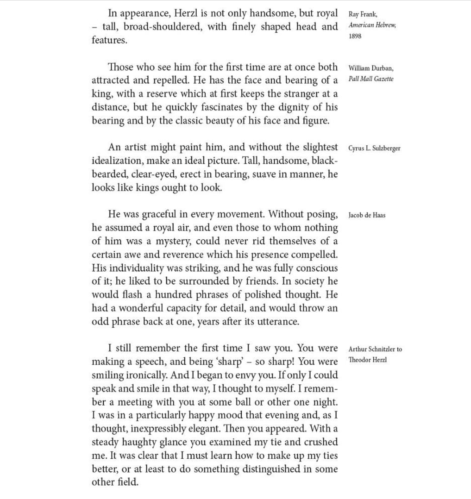

# Overview {.unnumbered}

This is a simple book project[[Download and see documentation for Quarto](https://quarto.org/), "an open-source scientific and technical publication system." ]{.column-margin} 
 allowing you to write straighforward Markdown and achieve a layout loosely inspired by Edward Tufte and more specifically by Rachel Cockerell's book *Melting Point*. It uses Quarto to render output to both responsive HTML and high-performance PDF via Latex.
The layout supports side-notes in the margins, but keeps traditional footnotes at the bottom of the page, and figure captions beneath the figures they label. Bibiographic references are resolved using the Bibtex data in a defined local file.

Simultaneously generate an HTML website and a PDF of the project with the standard quarto commands `quarto render` or `quarto render --to all`.

The following figure is a screen grab illustrating Rachel Cockerell's page layout.[Find out more about *Melting Point* on [Rachel Cockerell's professional website](https://www.rachelcockerell.co.uk).]{.column-margin} 

{#fig-cockerell} 

The [next page](./intro.qmd) demonstrates how to make your Markdown text work with this design.